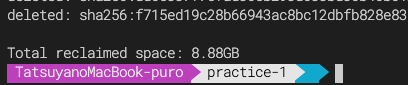

# Docker入門
本リポジトリはDockerを体系的に学習し、理解するためにまとめたものである。
README通りに一通り作業を行えば、Dockerについて理解できるハズである。
願わくば自分自身で環境構築がゼロベースで行えると良い。

# それぞれのファイルの説明
## practice-1
`practice-1`はDockerで簡単なサーバーを立ててみる練習ディレクトリである。ここでDockerの理解を実際のコードで深めていく。

## practice-2
`practice-2`ではDockerで`sinatra`と呼ばれる簡易サービス構築ライブラリを用いてDocker環境を構築するために作成されたディレクトリである。Railsで環境構築を行う前の練習に最適な理解を提供する。

## rails-practice
`rails-practice`では、実際にRailsのDocker環境を構築する。開発環境〜デプロイまで、実践的なDockerの環境構築に対する知識を得ることができる。

# Dockerことはじめ(前提知識)
## Dockerとは
Dockerとは何だろうか？結論から言うと、アプリケーションを簡単に開発・デプロイできるようになるツールである。

アプリケーション開発の環境構築は非常に時間がかかったり、大変であったりする場合が多い。そこでDockerの登場である。

Dockerとは
- OS
- ライブラリ
- アプリケーション
全てをひとまとめにしたモノで、 **どの端末でも動く** 環境を構築できるものである。

テスト環境も、本番環境も、全てこのDockerでこなす事ができる。

- メンバーの開発環境の統一
- テスト環境や本番環境の統一
- デプロイの自動化

など、様々な視点で利点が多い。これを使わない手はないだろう。

# WindowsでDockerを構築するには
WindowsでDockerを動かすには少し手の込んだ操作が必要である具体的には、`Windows Power Shell` `Ubuntu` `WSL2` の導入である。WindowsではLinuxを利用するためにWSL2をインストールする必要がある。
> WSL 2とはWindows Subsystem for Linux 2の略で、Windows 10上でLinuxを動作させるための仕組みであるWSLのバージョン2という位置付けである。

## Windows Terminal
`Windows Treminal`をMicrosoft Storeで入手する。

## WSL2
[microsoft document](https://docs.microsoft.com/ja-jp/windows/wsl/install-win10) を見ながら、WSL2のインストールを行う。

### ①管理者として PowerShell を開き、以下を実行
`Start-Process powershell.exe -Verb runas`で管理者権限でPowershellが起動するが、右クリックで管理者権限で起動でもよい。

`dism.exe /online /enable-feature /featurename:Microsoft-Windows-Subsystem-Linux /all /norestart`

### ②WSL2をインストール
端末を仮想化する。PowerShellを開き、以下を実行

`dism.exe /online /enable-feature /featurename:VirtualMachinePlatform /all /norestart`

再起動する。

### ③Linux カーネル更新プログラム パッケージをダウンロードする
[x64 マシン用 WSL2 Linux カーネル更新プログラム パッケージ](https://wslstorestorage.blob.core.windows.net/wslblob/wsl_update_x64.msi)を落として実行。

### ④WSL2を既定のバージョンとして設定する
通常のPowerShellで

`wsl --set-default-version 2`

# Dockerの中で起こっている事
Dockerは、アプリとライブラリ、OSをひとまとめにしたセットが「コンテナ」これを起動するイメージで概ねは大丈夫。

基本的にはアプリコードやOSが束ねられた~~イメージ~~があって、そのイメージを元に**コンテナ**を作成する。イメージは言い換えると雛形のようなものである。

# Docerで良く使うコマンドまとめ(practice-1の後が望ましい)
本項目は`practice-1`を修了した後に閲覧すると理解度が向上するため、まだの人はそちらを閲覧することを推奨する。

Dockerで良く使うコマンドは大きく分けて3つ

- ①ログの閲覧
- ②コマンド実行
- ③お掃除(イメージ・コンテナ整理)

である。

## ログはどうやってみるのか
`$ docker container run -d -p 8000:8000 --name webrick test/webrick:latest` 

`-d`をつけることでデーモン起動する事ができる。デーモン起動とは、バックグラウンド起動と同値である。
まずはコンテナ(本例はpractice-1で取り扱ったコンテナ名を利用している)を起動した上で、

`$ docker container logs [コンテナ名]`

で、コンテナで起きた**ログを閲覧**することができる。異常が起きた時に確認するために使うコマンドなので万が一に備えて覚えておきたい。

## コマンド実行
dockerの実行中のコンテナで他に実行したいコマンドがある場合が折々存在する。
そんなときは、

`$ docker container exec [コンテナ名] [実行したいコマンド(ruby -v等)]`

で実行する事が可能である。

`$ docker container run [コンテナ名] [実行したいコマンド(ruby -v等)]`

で、コンテナを新たに起動すると共に実行も同時に行う。`run`は多用するとコンテナが多数動作するため、基本的には`exec`を利用する事を心がける。

## お掃除について
使わないコンテナやイメージを一掃する時に使えるコマンドがあるので紹介しておく。
Dockerを使って作業をしているうちに、空き容量が少なくなってきたりゴミが増えてしまったときに非常に重宝する。

`$ docker system prune -a`

[docker pruneで不要になったcontainerやimageを削除する](https://n350071.com/docker-prune/)

上記のサイトが参考になる。

自分がやったらこんなに容量を圧迫してたので、定期的に行うといいと思う。

