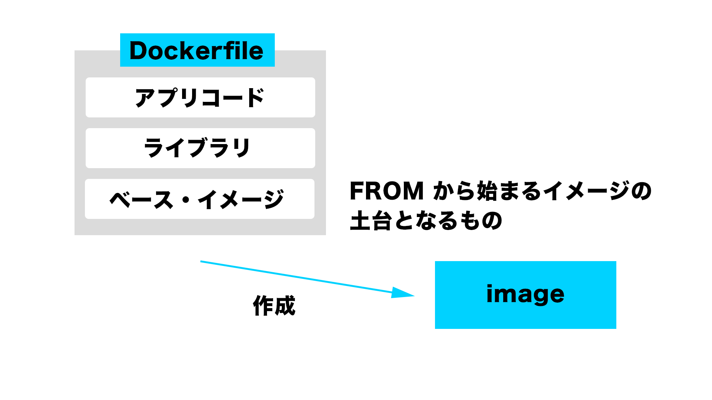

# practice-1
## dockerの基礎を理解する


Dockerは、アプリとライブラリ、OSをひとまとめにしたセットが事前に用意されており、これを**イメージ(Image)**と呼ぶ。

このイメージを元に**コンテナ**を作成する。そのコンテナを起動する事でDocker上に環境を構築する事ができる。
ゲストOSを必要としないため非常に軽量。
動作に必要な物がDockerイメージにまとまっているため、Dockerがインストールされている環境なら同じように動作する。
これによって開発環境と本番環境の違いを気にせず開発に集中できるというメリットがある。

## docker run hello-worldを読み解く
dockerの一連の流れを体験するためにまずは
`docker run hello-world`

を実行してみる。これを紐解いていく。このような表示が出るハズである

```Bash
Unable to find image 'hello-world:latest' locally
latest: Pulling from library/hello-world
d1725b59e92d: Pull complete
Digest: sha256:0add3ace90ecb4adbf7777e9aacf18357296e799f81cabc9fde470971e499788
Status: Downloaded newer image for hello-world:latest

Hello from Docker!
This message shows that your installation appears to be working correctly.

To generate this message, Docker took the following steps:
 1. The Docker client contacted the Docker daemon.
 2. The Docker daemon pulled the "hello-world" image from the Docker Hub.
    (amd64)
 3. The Docker daemon created a new container from that image which runs the
    executable that produces the output you are currently reading.
 4. The Docker daemon streamed that output to the Docker client, which sent it
    to your terminal.

To try something more ambitious, you can run an Ubuntu container with:
 $ docker run -it ubuntu bash

Share images, automate workflows, and more with a free Docker ID:
 https://hub.docker.com/

For more examples and ideas, visit:
 https://docs.docker.com/get-started/
```
- ローカルにhello-world:latestがないため、DockerHubからイメージを取得
- イメージをsha256でハッシュ化
- ダウンロード完了

という一連の流れが実行されている。

クライアント(自分のPC)がdocker runすると、ホストであるdockerデーモンが処理を実行する。コマンドを受け取ったホストであるdockerデーモンが、レジストリからイメージを持ってきて、それを「コンテナ」にする。ここでいうイメージはクラウドに保存されてる雛形の事。
これが、Dockerでアプリを動かすための基本的な流れである。

## Dockerでサーバーを作ってみる
`webrick`というRuby標準のサーバライブラリを用いて実際にDocker上でサーバーを作ってみる。
WEBrickは、Rubyの標準ライブラリです。Webサーバー用フレームワークという立ち位置。
以下、WEBrickについて↓気になれば書き方はここに。

[参考サイト：WEBrickを使うためのメモ](https://lemniscus.hatenablog.com/entry/20090722/1248261257#httpserverhandler)

### Dockerfileの作成
```:Dockerfile

FROM ruby:2.7

# ディレクトリの作成, 単純なコマンドの実行 "RUN"
RUN mkdir /workspace
# main.rbをworkspaceディレクトリに移動
COPY main.rb /workspace

# Dockerイメージを起動した時に実行するコマンド "CMD"
CMD ["ruby", "/workspace/main.rb"]

```
まずはベースとなるディスク(Docker)イメージはFROMで要求。RUNでコマンドの実行を行う。CMDでDocker「イメージを起動した時に実行する」コマンドを記述する。

同時に、同ディレクトリ上に`main.rb`を作成する

```ruby:main.rb
require 'webrick'

server = WEBrick::HTTPServer.new(
  # 今いるディレクトリ
  DockmentRoot: './',
  # 任意のIPアドレスを指定
  BrindAddress: '0.0.0.0',
  # ポートは自由に
  Port: 8000
)

# サーバの仕事の中身は、HTTPServerクラスのmount_procメソッドによって指定できる。
# 次のように書く。

# server.mount_proc(dir) {|req, res|
#   # 具体的な仕事をここに書く
# }

# ルートディレクトリでhelloというレスポンスを返す
server.mount_proc('/') do |req, res|
  res.body = 'hello'
end

# サーバーを起動させる
server.start
```

### Docker imageの作成


ここまできたらイメージの作成準備は整った。

`$ docker image build `

でDockerイメージを作成する事ができる。

`$ docker image build -t test/webrick:latest .`

`-t`オプションはタグをつけるために使用する。今回指定したタグ名は`test/webrick:latest`で、`タグ名:バージョン`の順で記述する。最後の`.`は今いるディレクトリにあるDockerfileをビルドするという意味である。

これで、Dockerイメージを作成することができた。

### イメージからコンテナを作成して起動する
実際に作成されたイメージからコンテナを起動してみる。

`$ docker container run -p 8000:8000 —name webrick test/webrick:latest`

`-p`オプションではポート番号を指定する。`(ローカルのポート番号):(Dockerで接続するポート番号)`の順であり、ローカルとDockerのポート接続関係を記載する。`-name`オプションはコンテナ名を付けるために利用する。後々設定しておいた方が楽であり、名前は何でも良い。最後に、元になるイメージ名を記載する。

ポート番号は他サービスを起動していた場合衝突が起きるため、利用する番号について注意が必要である。


レスポンスが確認できた、Dockerコンテナが起動してサーバーがその上で動作しているのがわかる。


