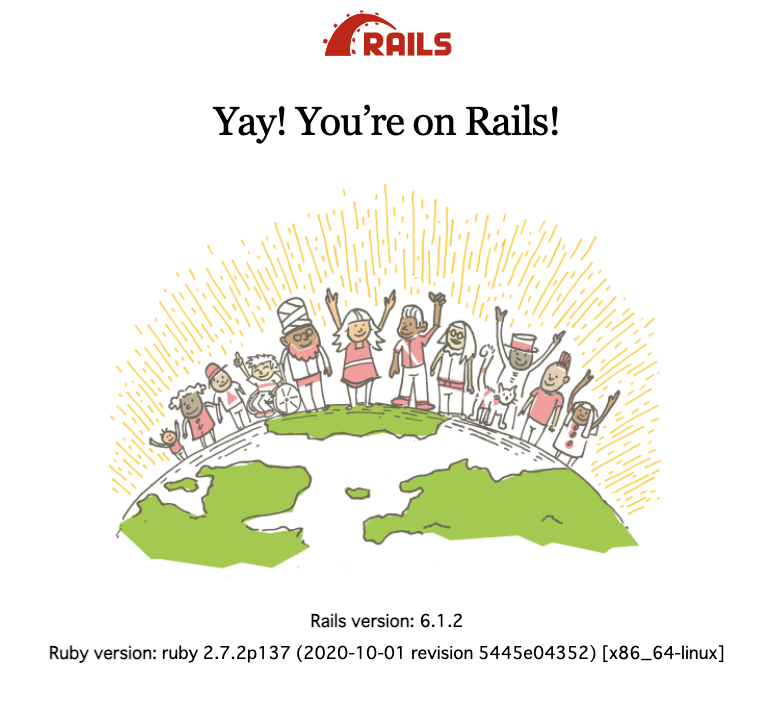
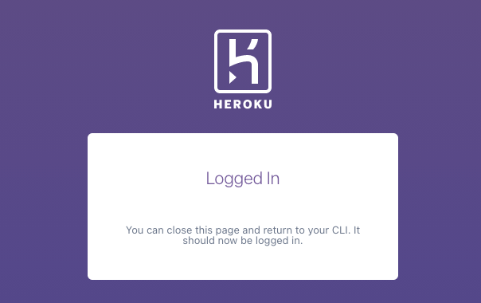
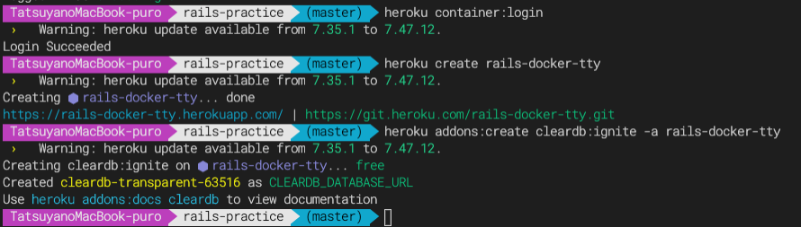
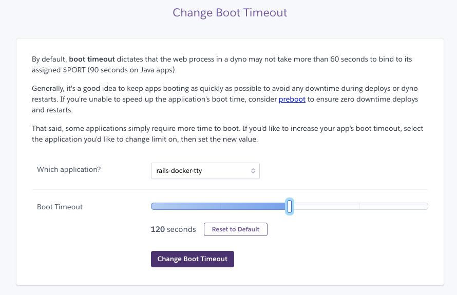

# rails-practice
## DockerでRailsの環境構築をする
ここまでの知識でベースのdockerについての知識はついているが、実際に開発するとなるとまだ不十分。
理由は、Webアプリケーションは一つのサーバーで動いている場合は稀で、アプリケーションサーバ・DBサーバ等複数のサーバが連携して一つのサービスになっている場合が多いからである。

そこで現れるのが**docker-compose**。
それぞれのサーバーをひとまとめにして様々な物事を実行できるコマンド・概念である。

`docker-compose.yml`に記述することで複数のdockerコンテナを管理できる優れものである。
それぞれのサービスごとに設定を記述する。

## docker-composeの基本操作
- イメージのビルド
`$ docker-compose build`

- コンテナの作成と起動
`$ docker-compose up -d`

- コンテナを停止・削除
`$ docker-compose down`

## その他docker-composeでよく使うコマンド

- コンテナの一覧を表示

`$ docker-compose ps`

- ログを表示

`$ docker-compose logs`

- コマンド実行用のコマンド
  - ①コンテナを作成してコマンドを実行する場合
  `$ docker-compose run [サービス] [コマンド]`
  
    →1からコンテナを作成してコマンドを行う

  - ②起動中のコンテナに対してコマンドを実行する場合
  `$ docker-compose exec [サービス] [コマンド]`

## DockerでRailsの環境構築編
### ファイルの作成
以上を踏まえて実際にDockerでRailsの環境構築に入る。まず`Dockerfile`, `Gemfile`, `docker-compose.yml`をそれぞれ作成。

```Bash:Dockerfile
FROM ruby:2.7

# # nodejs yarn をインストールするためのコマンド. 上3行はクローズドissueからの参考コマンド
# # https://github.com/yarnpkg/yarn/issues/7329
# RUN curl -sS https://dl.yarnpkg.com/debian/pubkey.gpg | apt-key add - \
#   && echo "deb https://dl.yarnpkg/debian/ stable main" | tee /etc/apt/sources.list.d/yarn.list \
#   && apt-get update -qq \
#   && apt-get install -y nodejs yarn

## nodejsとyarnはwebpackをインストールする際に必要
# yarnパッケージ管理ツールをインストール
RUN apt-get update && apt-get install -y curl apt-transport-https wget && \
curl -sS https://dl.yarnpkg.com/debian/pubkey.gpg | apt-key add - && \
echo "deb https://dl.yarnpkg.com/debian/ stable main" | tee /etc/apt/sources.list.d/yarn.list && \
apt-get update && apt-get install -y yarn

# Node.jsをインストール
RUN curl -sL https://deb.nodesource.com/setup_7.x | bash - && \
apt-get install nodejs

WORKDIR /app
COPY ./src /app
RUN bundle config --local set path 'vendor/bundle' \
  && bundle install
```

`Dockerfile`はRails6かから`webpacker`が標準搭載となったため、`nodejs`, `yarn`のライブラリを事前にインストールしておく必要がある。残りはこれまで学習した通りである。

```ruby:src/Gemfile
source 'https://rubygems.org'

gem 'rails', '~> 6.1.2'
```

`rails`を取得してくるために`Gemfile`に記述する。

```Bash:docker-compose.yml
version: '3'
services:
  db:
    image: mysql:8.0
    # MySQL8.0からはログイン認証方式がcaching_sha2_passwordに
    # MySQL5と同じログイン認証方式に変更が必要
    command: --default-authentication-plugin=mysql_native_password
    volumes:
      - ./src/db/mysql_data:/var/lib/mysql
    environment: 
      # mysqlはパスワードを設定していないとエラーになる
      MYSQL_ROOT_PASSWORD: password
  web:
    # imageはカレントディレクトリのDockerfileを参照する
    build: .
    command: bundle exec rails s -p 3000 -b '0.0.0.0'
    volumes:
      - ./src:/app
    ports:
      - "3000:3000"
    # 依存関係。DBと連携。通常であればDBサービスのIPアドレスを入れる必要があるが、サービス名を入れるだけで連携可能
    depends_on:
      - db
    # pryを使用してデバッグができるよう設定
    tty: true
    stdin_open: true
```

以上のファイルを作り終えたら、

`$ docker-compose run web rails new . --force --database=mysql`

以上の様にコマンドを打ち、作成したwebコンテナに対して、Railsコマンドを実行する。

Rails6からはwebpackerが標準搭載のため、さらにRailsにwebpackerをインストールする作業も行う。

`$ docker-compose run web rails:webpacker install`

`Gemfile`や`Dockerfile`の内容が上書きされた場合は再度イメージをビルドしなおす。

### DBの設定
`src/source/config/database.yml`より、DBの設定をコンテナの定義に合わせる。

```yaml:src/source/config/database.yml
# SQLite. Versions 3.8.0 and up are supported.
#   gem install sqlite3
#
#   Ensure the SQLite 3 gem is defined in your Gemfile
#   gem 'sqlite3'
#
default: &default
  adapter: mysql2
  encoding: utf8mb4
  pool: <%= ENV.fetch("RAILS_MAX_THREADS") { 5 } %>
  username: root
  # パスワードは設定した通りに
  password: password
  # ホストはdb(DBのアプリケーション名)へ変更
  host: db
  timeout: 5000

development:
  <<: *default
  database: app_development

# Warning: The database defined as "test" will be erased and
# re-generated from your development database when you run "rake".
# Do not set this db to the same as development or production.
test:
  <<: *default
  database: test_development

production:
  <<: *default
  database: production_development
```

以上の設定が終わったら、

`$ docker-compose run web rails db:create`

で、Rails上にデータべースを作ることができる。ファイルを定義しただけではDBは実際には作られず、このコマンドをしっかりと打つ必要がある。このような表記がターミナルに出たら成功である。

```Bash
Creating rails-docker_web_run ... done
Created database 'app_development'
Created database 'test_development'
```

### Railsサーバーを起動する
`$docker-compose up`



を実行すると、ローカルホストから接続したDocker上で、サーバーの起動が確認できるハズである。
あとはローカルのファイルに変更を加えながらサーバー上で変更をチェックして、開発するという流れである。

サーバーの停止は`Ctrl+C`でも良いし、別ターミナルを開いて`$ docker-compose down`でも良い。

# 本番環境の構築

以上を以て「開発時の」Docker環境を構築することはできたが、本番環境に利用してこそDockerの利用価値が増大する。
本番で使わないと、サーバーに対して手動でライブラリを導入する必要がある。かつ、ローカルと差異が起きてエラーが出る可能性がある。

Dockerを導入すると以上のデメリットを解消する事ができる。

## Herokuでコンテナを起動する(事前準備編)

Herokuとはサーバー, DB, ミドルウェア等を提供するPaaSである。

### 事前にgitconfigでやっておいた方がいい事
`git config --global user.name "[username]"`
`git config --global user.email "[useremail]"`
`git config --global merge.ff false`
`git config --global pull.rebase merges`

### heroku cliのインストール
heroku-cliをインストールしておく。

### Herokuへ登録
Herokuへ事前に登録しておく。

## Herokuでコンテナを起動する(Heroku準備編)
では実際に準備が整ったところで作業へ入る。

`$ heroku login`

でブラウザが立ち上がるため、クリックしてログインを行っておく。


次に、herokuのコンテナレジストリにログインする。これはDockerのイメージ置き場であり、ログインする事でDockerイメージをアップロードする事ができる。

`$ heroku container:login`

## Herokuでコンテナを起動する(Herokuアプリ作成編)
`$ heroku create rails-docker-〇〇`

で、Herokuアプリケーションを作成する。○○には何か独自のワードを入れて欲しい。世界中のHerokuアプリの名前と重複しない様に設定する必要がある。

## Herokuでコンテナを起動する(DB追加編)
Herokuアプリケーションの作成が終わったら次にDBの作成・設定を行う。Herokuではアドオンを追加する形でDB(MySQL)を追加する。`cleardb:ignite`のみ無料で利用できるので、それを利用して構築を行う。ただしこのDBはMySQL5系であり、本来であればローカルを5系に統一するか、アドオンを有料で購入して8系に統一するか、どちらかに合わせる様な設計をするのが望ましい。今回は練習のため、このまま5系のものを利用する。

`$ heroku addons:create cleardb:ignite -a(アプリケーション指定) rails-docker-〇〇`



これでDBがインストールできた。

### 環境変数を追加する
`src/config/database.yml`におけるDBの接続先情報の変更を行う。直接接続先を記載するとセキュリティリスクがあるため、実際の情報は環境変数に格納することにする。

```yaml:src/config/database.yml
# production環境のみ変更する
production:
  <<: *default
  database: <%= ENV['APP_DATABASE'] %>
  username: <%= ENV['APP_DATABASE_USERNAME'] %>
  password: <%= ENV['APP_DATABASE_PASSWORD'] %>
  host: <%= ENV['APP_DATABASE_HOST'] %>
```

これでHerokuに環境変数を与えるだけでDBに接続できる。`$ heroku config -a [アプケーション名]`で情報を確認できる。

`mysql://[ユーザー名]:[PW]@[ホスト名]/[DB名]`

となっているハズである。
この情報を接続先情報を環境変数に格納する。

`$ heroku config:add APP_DATABASE='[DB名]' -a [アプリ名]`

`$ heroku config:add APP_DATABASE_USERNAME='[ユーザー名]' -a [アプリ名]`

`$ heroku config:add APP_DATABASE_PASSWORD='[PW]' -a [アプリ名]`

`$ heroku config:add APP_DATABASE_HOST='[ホスト名]'`

以上の設定ができているか確認する方法は、
`$ heroku config -a [アプリ名(rails-docker-〇〇)]`

これでHeroku上のDBへ接続できるようになった。

## Herokuでコンテナを起動する(Dockerfileを本番用に修正編)
処理が本番とローカルで若干違う点があるのでそこの処理に対応する様にコードを修正する必要がある。

```Bash:Dockerfile
FROM ruby:2.7

# 追加
ENV RAILS_ENV=production

## nodejsとyarnはwebpackをインストールする際に必要
# yarnパッケージ管理ツールをインストール
RUN apt-get update && apt-get install -y curl apt-transport-https wget && \
curl -sS https://dl.yarnpkg.com/debian/pubkey.gpg | apt-key add - && \
echo "deb https://dl.yarnpkg.com/debian/ stable main" | tee /etc/apt/sources.list.d/yarn.list && \
apt-get update && apt-get install -y yarn

# Node.jsをインストール
RUN curl -sL https://deb.nodesource.com/setup_7.x | bash - && \
apt-get install nodejs

WORKDIR /app
COPY ./src /app
RUN bundle config --local set path 'vendor/bundle' \
  && bundle install

COPY starat.sh /start.sh
# 実行権限の付与
RUN chmod 744 /start.sh
CMD ["sh", /start.sh]
```

ルートディレクトリに`start.sh`を作成し、以下の様に記述。
```Bash:start.sh
#!/bin/sh

if [ "${RAILS_ENV}" = "production" ]
then
  bundle exec rails precompile
fi

# 環境変数PORTに番号が入っていればそれを使い、そうでなければ3000を利用する
bundle exec rails s -p ${PORT:-3000} -b 0.0.0.0
```

まず、shファイルを作る理由としてはDockerfile上で`if`分岐がやりにくいため、わざわざシェルスクリプトを作成して分岐を行う様設定している。本番環境でのみ発動するコマンドをここに記載する。Railsは本番環境でJSやCSSをまとめてコンパイルするprecompileを行う必要があり、その動作を実現するために上記の様なファイル構成・書き方となっている。`#!/bin/sh`はシェルスクリプトに書くおまじないの様なものである。

Herokuでassets:precompileが起動するために必要なコマンドも別途打っておく。

`$ heroku config:add RAILS_SERVE_STATIC_FILES="true" -a [アプリケーション名]`

### Herokuのタイムアウト設定を変更しておく
デフォルトのポートバインド秒数は60sであるが、タイムアウトになる事が多々あるためこの秒数を伸ばしておく。
[Timeout設定のページ](https://tools.heroku.support/limits/boot_timeout)へ行き、60s→120sへ変更する



### Herokuでコンテナを起動する前にローカルのサーバーを一旦リセットしておく
Herokuでコンテナ(サーバー)を起動する際、ローカルでサーバーを起動しているとコンフリクトを起こしてエラーが出る場合が存在する。そのため。一旦全てのローカルサーバーをリセットしておく必要がある。

`$ docker-compose down`

もしくは、

`$ rm src/tmp/pids/server.pid`

でサーバー起動をクリーンにしておこう。ここまできたらリリース準備が完了である。

## Herokuでコンテナを起動する(Dockeイメージをビルドしてリリース)
流れとしてはDockerイメージをビルドして、それをHeroku上にPushするという流れである。

`$ heroku container:push web -a [アプリケーション名]`

これでDockerイメージをビルドして、コンテナレジストリにそれをPushすることができる。

次に、アップロードしたイメージから、Heroku上へコンテナを展開(リリース)する。

`$ heroku container:release web -a [アプリケーション名]`

これで実際にHeroku上にコンテナをリリースする事ができる。

### 補足：Heroku上でDBの更新がしたい時
`$ heroku run bundle exec rake db:migrate RAAILS_ENV=production -a [アプリケーション名]`

これでRailsアプリをマイグレーションする事ができる。

ここまできたら、Heroku上でアプリが確認できるハズである。

`$ heroku open`

これでアプリを起動できる。`The page does not exist`とでたらOKである。現時点でpageが作られてないが、Railsはデプロイされている証である。

## Herokuでエラー解析を行う時
以下の設定をしておくとさらに詳細なログが見れる。
`$ heroku config:add RAILS_LOG_TO_STDOUT='true' -a [アプリケーション名]`

`$ heroku logs -t -a [アプリケーション名]`
で、ログを確認可能。

## トップページを追加して確認してみる
Heroku上でトップページが確認できる様に、トップページを追加してみるところまでやってみる。

`$ docker-compose exec web bundle exec rails g controller users`

```ruby:config/routes.rb
get '/', to: 'users/index' #<<追加する
```

```ruby:src/app/controller/users_controller.rb
# indexアクションを追加
def index
end
```

```ruby:src/app/views/users/index.html.erb
<h1>Hello, World!</h1>
```

ローカルホストでトップページが確認できたらHerokuへ反映していく。
サーバーを念の為再度終了させておく事。

イメージをプッシュ>イメージをリリース>open

これでHerokuのトップページ上に「Hello, World!」が表示されたハズである。
